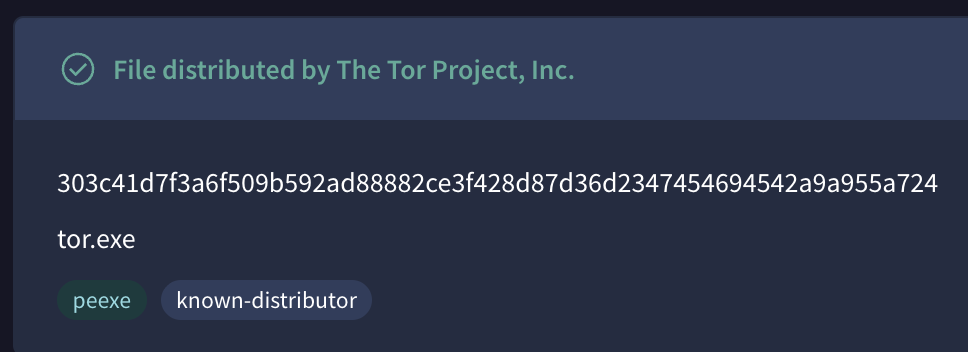

# VDM Ripper

Explore informations from Windows Defender VDM files


> Note: in order to retrieve the `.extracted` files, you can use the [WDExtract](https://github.com/hfiref0x/WDExtract/) tool

## vdmviewer

Display VDM file in a hex format, with colored sections to make it easier to read through it manually

```
$ python3 vdmviewer.py mpasbase.extracted
```


You can manually specify Threats to include in the output:
```
$ python3 vdmviewer.py mpasbase.extracted -t "RaccoonWifi"
```


> Note: `THREAT_BEGIN` is always in green and `THREAT_END` in red

You also can only filter specific signature types that you want to see (you can see the full list of current signatures types in the [json file](./sig_types.json))
```
$ python3 vmdviewer.py mpasbase.extracted -f SIGNATURE_TYPE_VFILE
``` 


> Here we dump the virtual files present during the defender emulation process

## vdmripper

Extract files from the VDM, here are the supported extractions types:
- vfs: extract the virtual file system used during emulation
- lua: extract lua snippets used for malware detection
- friendly_files: extract hashes of safe file defined by microsoft

#### VFS
```
python3 vdmripper.py mpasbase.extracted -e vfs
```
This extractd about 128 files from the virtual file system used during the emulation. I noticed that some known files used for evasion bypass are not present anymore (`aaa_TouchMeNot_.txt` for example)


#### LUA
```
python3 vdmripper.py mpasbase.extracted -e lua
```

This extracts 52k (at the time of writing the tool) Lua files used for the defender ASR ruling, they are stored in the following structure:
```
./output
	/threatname
		/<md5hash>.luac
		/<md5hash>.meta
```

The extraction of the mplua files is completed with the tool made by [Commial](https://github.com/commial/experiments/tree/master/windows-defender/lua) during his research on the topic that fixes the header of the file to make it readable by [luadec](https://github.com/viruscamp/luadec). You can automatically decompile the lua files by specifying the path of the luadec executable with `--luadec /path/to/binary`


#### Friendly files
```
python3 vdmripper.py mpasbase.extracted -e friendly_files
```

This extracts around a million sha256 hashes of safe files defined by microsoft. The signature type exist for sha512, but for now no hashes are sha512.

```
./output
	/FriendlyFiles.sha256
```

We find interesting hashes inside, for example the very first hashes we find are hashes of the Tor browser executables.

